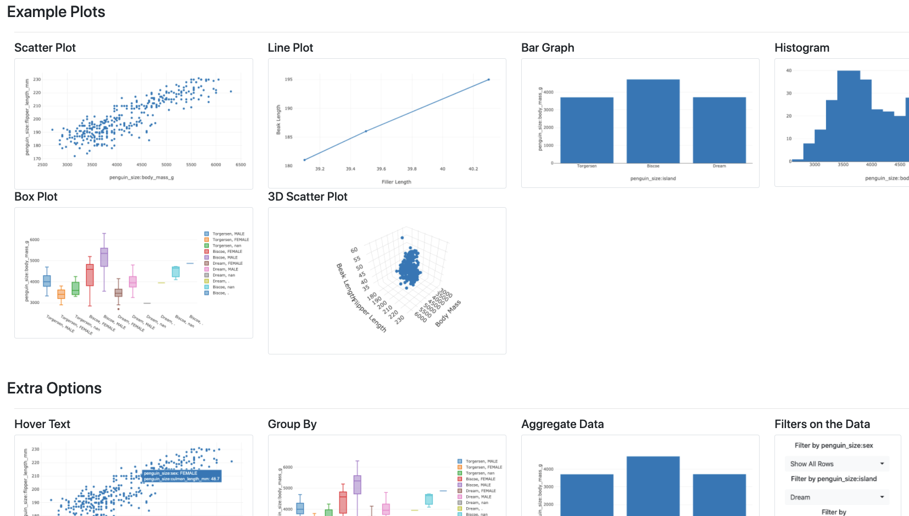

# Escalation

## What is Escalation?
Escalation is a web app that runs a lightweight visualization dashboard for data analysis. 
You can set up plots and tables that update along with your data or analysis, and have interactivity options to allow for data browsing.

Some user cases for Escalation:
- A research group that wants to have better visibility into experiments conducted by its members, or an at-a-glance record of experimental progress
- A project team at a small company that wants to share progress or up to date results with management

All that is required for is to set a config file, either by hand or using the included UI Configuration Wizard, 
and you can run Escalation locally or on a server for others to view.

We have a demo app running and [here](http://escalation-demo.sd2e.org/).

## Wait, aren't there already lots of different visualization tools out there?
Yes. Escalation has a few advantages:
- Straightforward and low-cost deployment
- Improved data privacy: everything can be hosted and run locally or on a server you control
- Open-source code
- Integration with data versioning and analysis pipelines (In development)

## Limitations of Escalation

- Currently uses either a SQL database or CSV files to store data. Escalation provides functionality to create a SQL database from CSV files

# Setup

## What do you need for the app to work?

Note, because of Docker issues with Windows, there may be substantial hiccups running on that operating system.
The instructions below have been tested on Mac and Linux.

- [Configure the app](#2.-Configuring-the-app)
    - Escalation uses configuration files (json) to build the dashboard organizational structure, link the data in visualizations, and construct the visualizations themselves.
    - These configuration files can be built by hand, using the Configuration Wizard, or any combination of the two
- [Data](#2.2-Load-your-data) 
    - When setting up Escalation, you choose to use either a CSV or SQL backend.
    - Depending on the backend, you'll either link the app to a database (new or existing) or a file system path containing your data files. 
     A file backend may be easier for those unfamiliar with SQL, but SQL is more performant, and storing data in a database offers advantages beyond the database's use in Escalation
    - Escalation includes tooling to ingest CSV files into SQL, automatically building the necessary SQL data tables and the code necessary to integrate them with Escalation.
    - ToDo: Data Migration helpers- what happens when the format of your data changes over time?
- [Python environment to run the app](#3.-Running-the-configured-app)
    - You need a Python environment set up to run the web app. See instructions for setting up an environment, using Docker to handle the environment for you.

Each of these components are discussed further below.

## 1. Set up your local environment to run the web app and database using Docker

From the root level of the code repository, run: 

`docker-compose build`

(this takes a little while the first time, as components are downloaded and installed)

We recognize that Docker is less common in academic settings, but highly recommend using it. 
Here are [instructions](https://docs.docker.com/get-started/) on getting started using Docker.
We use the Docker containers to run our configuration wizard, as well as the scripts to ingest csv data into a SQL database.
Once we set up a configuration and your data, we'll also use these containers to run the web app.

## 2. Configuring the app

### 2.1 Run the Configuration Wizard

Run the configuration wizard app from the root directory of this repo:
    
    ./escalation/scripts/wizard_launcher.sh
    
This launches the UI Configuration Wizard in a Docker container. Navigate in your the web app in your browser at: 
[http://localhost:8000/wizard](http://localhost:8000/wizard) or [http://127.0.0.1:8000/wizard](http://127.0.0.1:8000/wizard)
This app runs in debug mode, and should detect the changes you make as you edit the configuration. 
Refresh your browser to update the contents to match your saved configuration.
     
Some notes on [creating your first config files with the UI wizard](config_information/wizard_guide/creating_first_graphic_with_wizard.md).  

This includes a gallery of various chart types and how they're configured.

#### Build a config from scratch (advanced, optional)
Run `python build_app_config_json_template.py` to build a base config file. 
Everything blank or in `<>` should be changed.

#### Debugging config files manually (advanced, optional)

How to set up [local file system and config](config_information/local_example/local_data_storage_config_info.md) for the app.  
An example of a [main config file](config_information/main_config_example/main_config_example.md).  
Examples of [different plots and graphic config files](config_information/plotly_examples/plotly_config_info.md).  
Examples of [different selectors](config_information/selector_examples/selector_config_info.md). 

### 2.2 Load your data

#### SQL database backend (recommended)
    
Escalation provides functionality to parse csv data files, determine the relevant sql schema,
 create tables in the SQL database from your file, and create the necessary `models.py` file for the app to interact with the database. 
This creates sql tables that can be used by the graphics and tables on your Escalation dashboard.

In the configuration wizard in your browser, navigate to [http://localhost:8000/upload](http://localhost:8000/upload)

Use this web form to upload each file you'd like to use for your visualizations and include in the database. 
Note, it may take a little while to run.

If you'd like to add more than one csv to the same table, you have two options: 
combine them before uploading, or submit the additional CSVs using the  "Append to existing table" option.

Todo: If you have an existing SQL database, how do you copy it into Escalation?
 We require each table to have an `upload_id` column, and a key that is unique within an `upload_id` value
 (i.e, the pair `(upload_id, row_index)` is a unique key.)
 
Todo: Add csvs programatically using a script

#### CSV data file system backend

Instead of using a SQL database to store the data, this uses CSV files stored in a file structure on disk.
This moves responsibility for file management to the user, and may have performance disadvantages for large files or many files.
We recommend using the SQL backend, however the file system backend is provided as an alternative. 
How to set up a [local file system backed](config_information/local_example/local_data_storage_config_info.md) Escalation app.  
    

## 3. Running the configured app

We recommend running the Escalation web app using the docker container:

Re-run the docker compose build command to re-launch the containers with the app including all of the configuration you just did:

    docker-compose up --build -d
    
To use the app, navigate in your browser to: [http://localhost:8000](http://localhost:8000) or [http://127.0.0.1:8000](http://127.0.0.1:8000)

To shut down the app and stop the containers:

    docker-compose down  
    

## Interacting with the SQL database

The app creates a SQL database running in a Docker container which stores uploaded data.
In addition to using the Escalation web app functionality, you can interact with this data as you would any other SQL database, writing queries or sql subroutines.
  
To connect directly to the SQL database, this command  

    docker exec -it escos_db psql -h localhost -p 5432 -U escalation -d escalation

### Resetting the SQL database

Run the reset script from the top level of the repository

    ./escalation/scripts/escalation-reset.sh
    
This deletes the volume associated with the database, where the data is stored, and resets a models.py code file that decribes the database.

Simply re-start the configuration as above(#2.-Configuring-the-app) to work from this blank state.

You can also manually delete tables in the sql database by connecting to the database directly and using sql commands. Note that this doesn't reset the models.py file, so may result in strange behavior.

    Connect to db:
    docker exec -it escos_db psql -h localhost -p 5432 -U escalation -d escalation
    
    List tables:
    \dt
    
    Drop table:
    DROP TABLE my_table;
    
    Disconnect:
    \q
   
### Uploading data files to the db from the command line

You can directly upload files by POSTing requests to the Escalalation upload endpoints.

http://localhost:8000/wizard/upload
http://localhost:8000/upload

There is a helper script in `escalation/scripts/csv_to_sql.py` that does this, with documentation there about how to use it.
    

# Running Escalation as a web-accessible server

In summary, you'll build a Docker-compose image that includes your dashboard configuration, and deploy it on a web-accessible server. 
This can be a server on a local network, e.g. in your lab, or on a cloud provider like [DigitalOcean](https://www.digitalocean.com/docs/droplets/quickstart/), Heroku, or AWS.

## Building your Docker image for deployment

1. You'll want to change the default settings for the password and username for the database, defined here: `escos/escalation/app_deploy_data/app_settings.py`
2. Todo: instructions to build docker image and push

# How can I contribute? (advanced)

## Running Locally, without using Docker (useful for Escalation code development, testing)

You can also set up a custom Python virtual environment and run the server locally as you would any other Flask web app. 
ToDo: More detailed instructions on virtual env setup, requirements install,  and running the app. Include info about db connection from host to Docker db

### Developing for Escalation

- `pip install -r requirements-dev.txt`
- `pre-commit install` sets up the pre-commit hooks to auto-format the code. This is optional, the repo is formatted with Flake and Black. 

### How to add a new type of plot
Development for Escalation has focused on Plotly, but the codebase should be compatible with other libraries or custom graphics. If you want to use something other than Plotly, your code should:
* Needs to inherit from graphic_class.py
* Be added to available_graphics.py
* Include an html file with javascript code required to plot

### How to add a new option feature
* add it to available_selectors.py
* create a html document input elements need name "\<id>|\<type>|<column_name>"
* add to create_data_subselect_info and reformat_filter_form_dict in controller.py
* build in functionality graphics_class or data_storer class
 

# License

The Apache 2.0 License applies to all code and materials associated with Escalation.

Copyright \[2020] \[Two Six Labs, LLC]

Licensed under the Apache License, Version 2.0 (the "License");
you may not use this file except in compliance with the License.
You may obtain a copy of the License at

http://www.apache.org/licenses/LICENSE-2.0

Unless required by applicable law or agreed to in writing, software
distributed under the License is distributed on an "AS IS" BASIS,
WITHOUT WARRANTIES OR CONDITIONS OF ANY KIND, either express or implied.
See the License for the specific language governing permissions and
limitations under the License.

