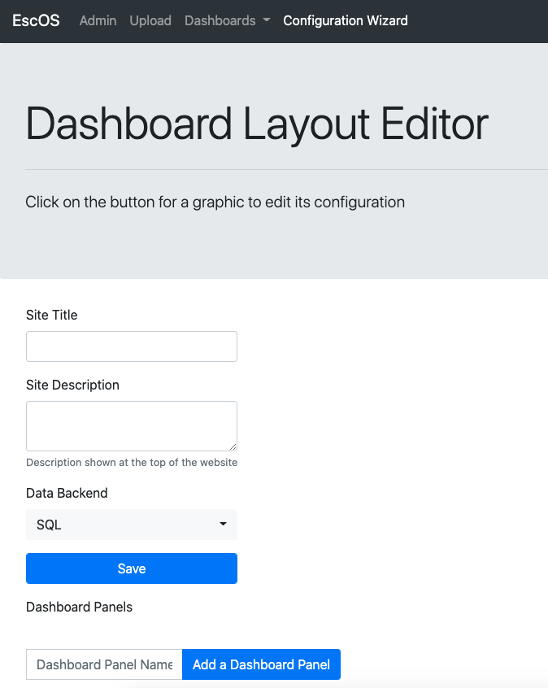
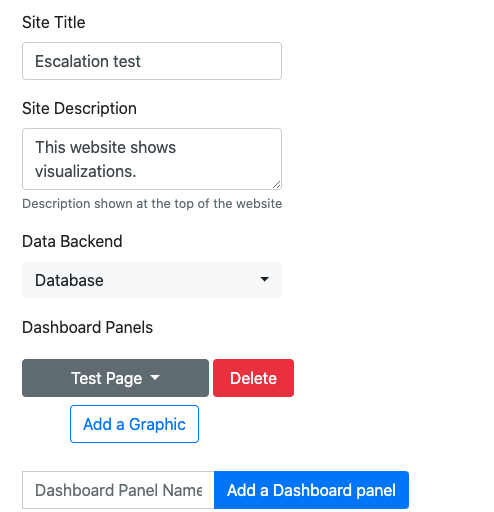
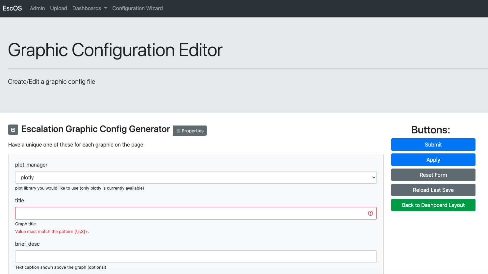
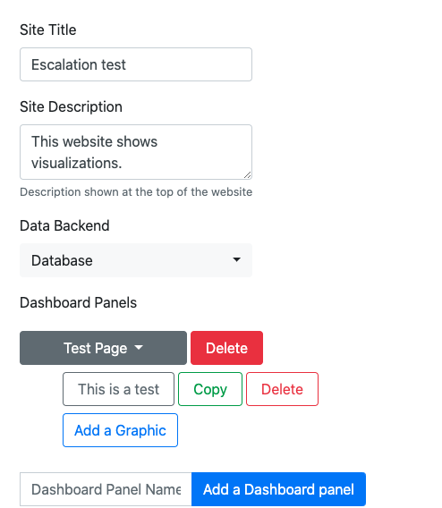

# Creating Your First Config Files with Wizard UI
This readme runs though creating the main config file and a graphic file using the wizard. Before starting this tutorial,
you should have set up your data (see database set up or [local data set up](../local_example/local_data_storage_config_info.md))
and have your docker container set up.
Ready? Let's begin.

- First open the url where wizard app is being hosted. Once open you should see

 - Fill out the title, description, data backend. Now let's add our first page. Add a name to the dashboard panel and
 click "Add a Dashboard Panel."

 - Now let's add a graphic to the page. Click "Add a Graphic"

- Click on your page to see which graphics are in the page.

- There currently are not any so let us add one. Type in a name and click add a graphic. You will be brought to the graphic 
config editor. 

Fill out the form.
 [The gallery](../gallery/index.html) contains a graphics and the forms that generated them. Once you are done hit submit.
Now you will have a graphic in your page. 

