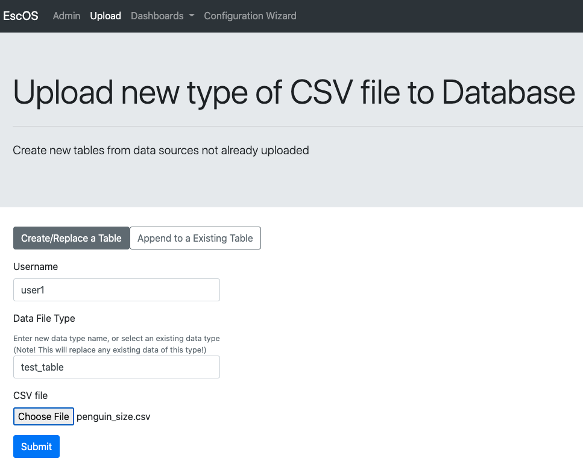
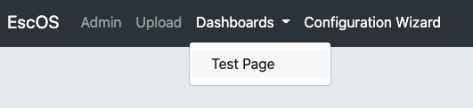

# Designing your dashboard layout using the Configuration Wizard UI

Before starting this tutorial, you should have your wizard app launched. 

Ready? Let's begin.

- First open the url where wizard app is being hosted: [http://localhost:8000/wizard](http://localhost:8000/wizard). Once open you should see

- First, fill out the title, a description for your dashboard, select the data backend you're using and click save.
- Next, to add data to the app, click on "Upload" on the navigation bar on the top. Give a username for the uploader, name your data table (Data File Type), pick a csv file to upload, and click submit. 
  

- Click on "Configuration Wizard".
- Now let's add our first page.
Enter a name for the new dashboard panel page and click "Add a Dashboard Panel."
 

- Now let's add a graphic to the page. Click "Add a Graphic"

- Fill out the form. The html example here
 [gallery/index.html](../gallery/index.html) (best opened and viewed in a browser) contains graphics and the forms that generated them. Once you are done hit submit.
Now you will have a graphic in your page. 

- You can see the graphic by clicking on "Dashboards" then on the title of your page.

