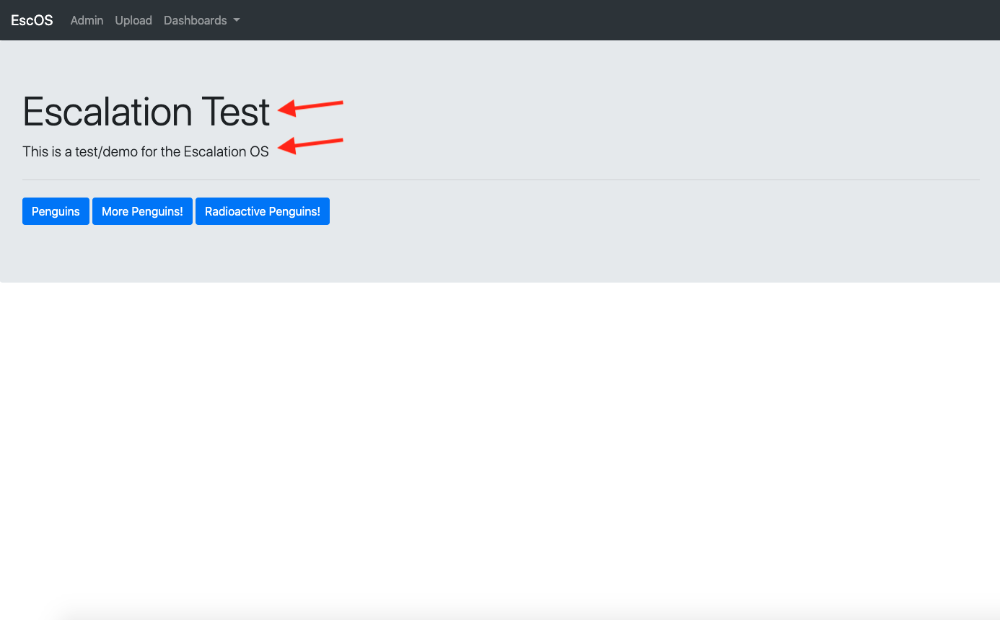
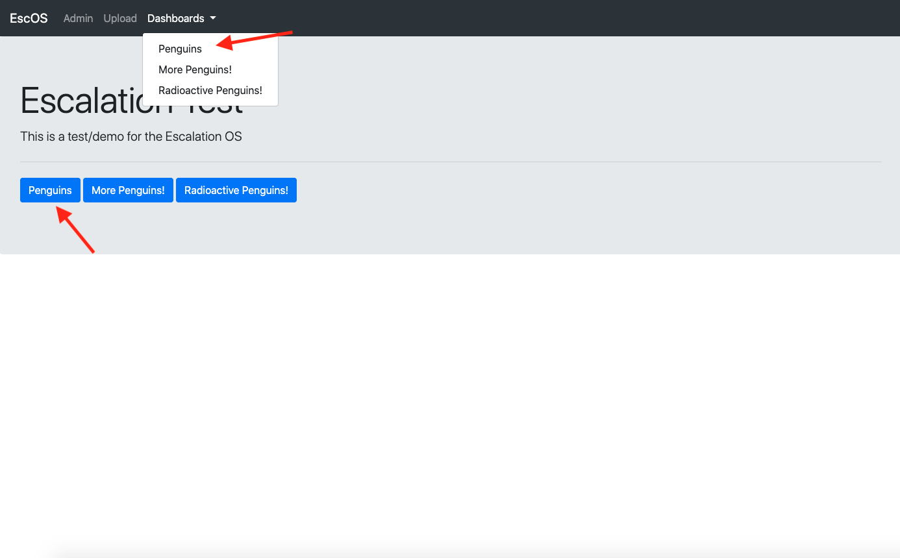

# Config example
This readme walks through the [main_config_file_example.json](main_config_file_example.json)
  file.

##
"title": "Escalation Test"  
"brief_desc": "This is a test/demo for the Escalation OS"

##

"data_backend": "postgres",  
"data_sources": \[
    "penguin_size",
    "mean_penguin_stat",
    "penguin_size_small"
\],  

data_backend -- Indicates that the data is stored in a Postres SQL db (currently the only supported backend)
data_sources -- folders that the website uses in data_file_directory (local_csv) (TODO: add for database)
##

"available_pages": \[
        {
            "webpage_label": "Penguins",
            "url_endpoint": "penguin",
            "graphic_config_files": \[
                "big_penguins.json",
                "hist_penguins.json"
            \]
        },
        {
            "webpage_label": "More Penguins!",
            "url_endpoint": "more_penguin",
            "graphic_config_files": \[
                "extra_penguins.json"
            \]
        },
        {
            "webpage_label": "Radioactive Penguins",
            "url_endpoint": "radio_penguins",
            "graphic_config_files": \[
                "radio_penguins.json"
            \]
        }
    \]  
    
available_pages - list of dictionaries that contains the information about each page
url_endpoint - nThis can be anything alpha numeric and underscores (without spaces). Determines the url

##
webpage_label - How the page is labeled on the site

##
graphic_config_files - list of the files that contain the json that contains the graphics
