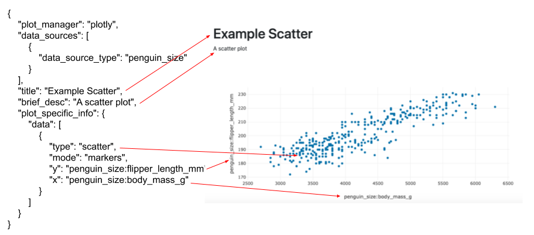
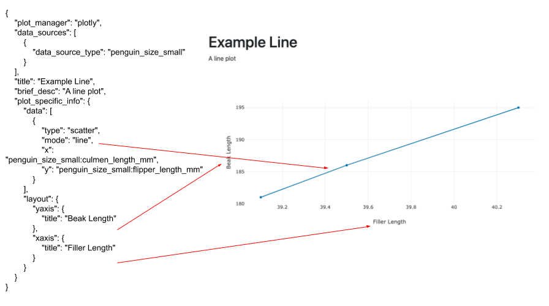
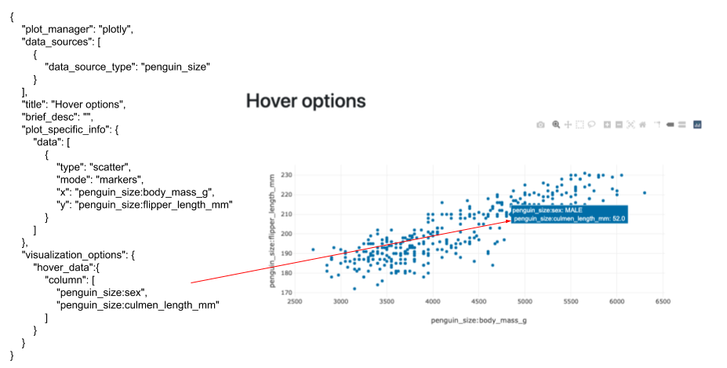
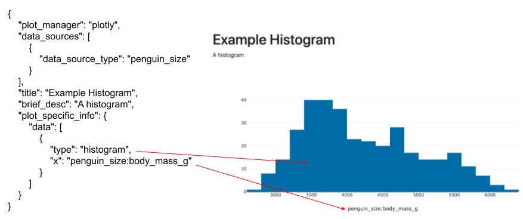
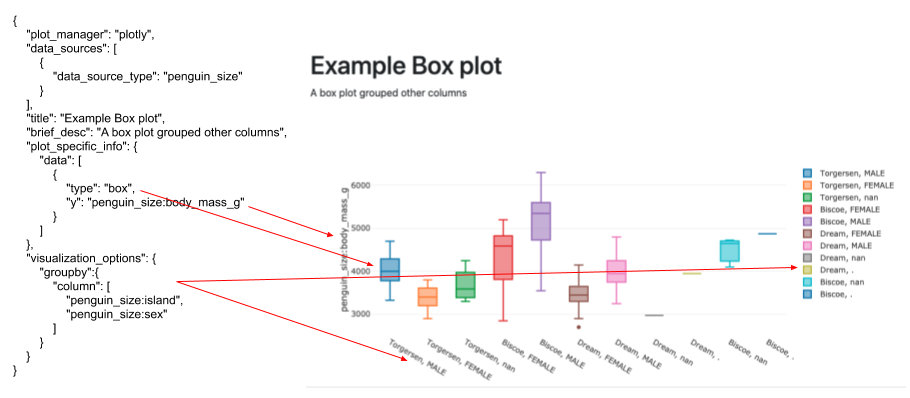
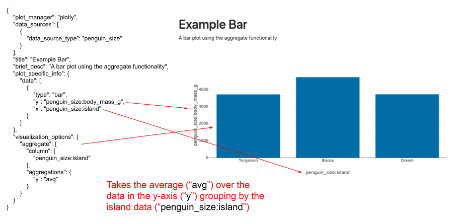
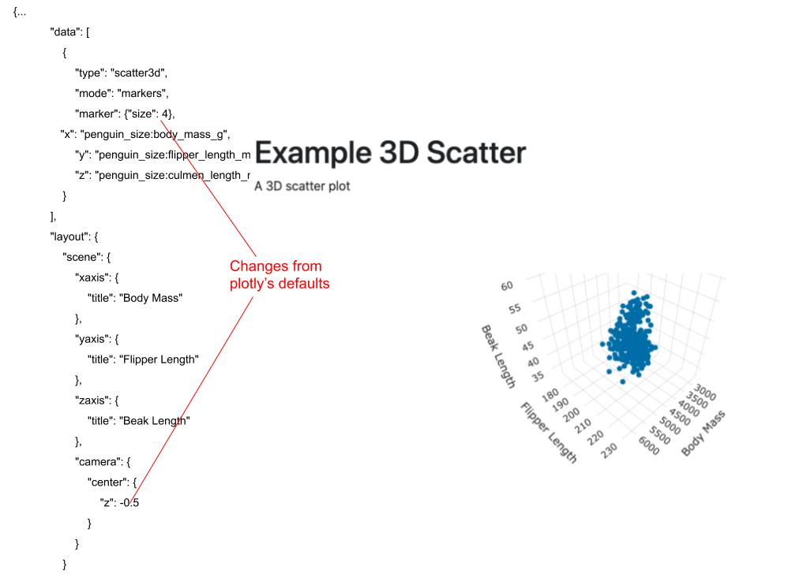

# Plotly Config Information

We have a lot of the Plotly graphing library built in to this application. This document explains how to edit the
config file in accordance with the Plotly schema. 
For a individual graphic each an individual json:
 - In the config json, plot_manager: plotly 
 - In "data", "data": \[{\<axis>:\<column_name>}\] 
 each element of the list corresponds which line on the plot the data corresponds to. 
 \<axis>. e.g. "x","y"
 - "plot_specific_info" : this config matches the config as defined by the plotly 
 documentation at https://plotly.com/javascript/reference/ with exception axes like "x" and "y"
 do not need to be defined again.
 
## Examples 
These examples will show the graphic config files on the left and the graphic produced on the right
 with commentary in red. All of the config files need to be used with the appropriate main config file

- A simple scatter plot

 - A line plot shows how to make custom labels for your axes
 
 - How to create hover text/tooltip for your data
 
 - How to create a simple histogram
 
 - A box plot using the groupby functionality
 
 - A bar chart using the aggregate functionality
 
 - A 3d scatter plot
 