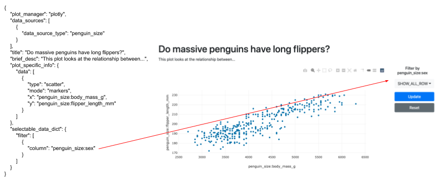
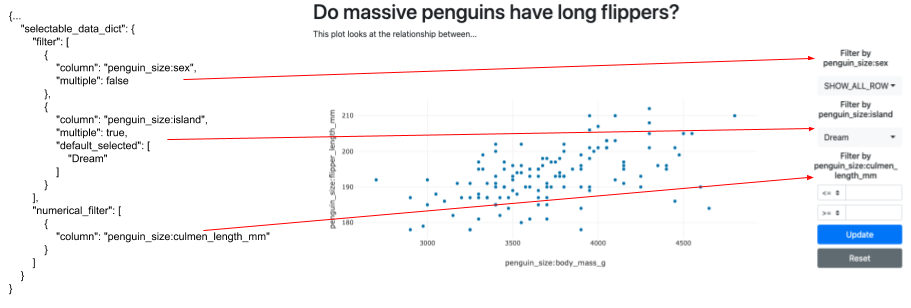
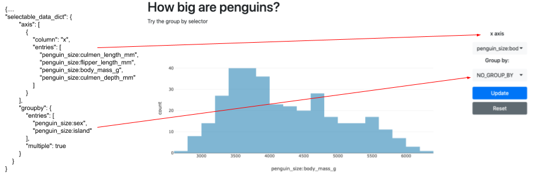

# Selector Config Information
This readme gives examples of different selector options.
These examples will show the graphic config files on the left and the graphic produced on the right.
 All of the config files need to be used with the appropriate main config file

- A filter makes a drop down that allows the user to sub-select along a column of the data.

 - The key "filter" is a list of dictionaries, each one creating a selector. You can allow multiple values to be selected
  and which value is selected when the app is started. Additionally you can define a "numerical_filter" for 
  equality/inequality filtering.
 
 - Also available are selectors for which data is shown along the axis and how the data is grouped.
 Note that "groupby" in "selectable_data_dict" is a dictionary instead of a list dictionaries.
 
