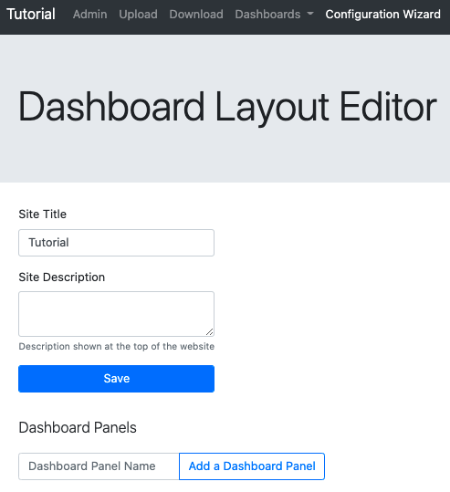
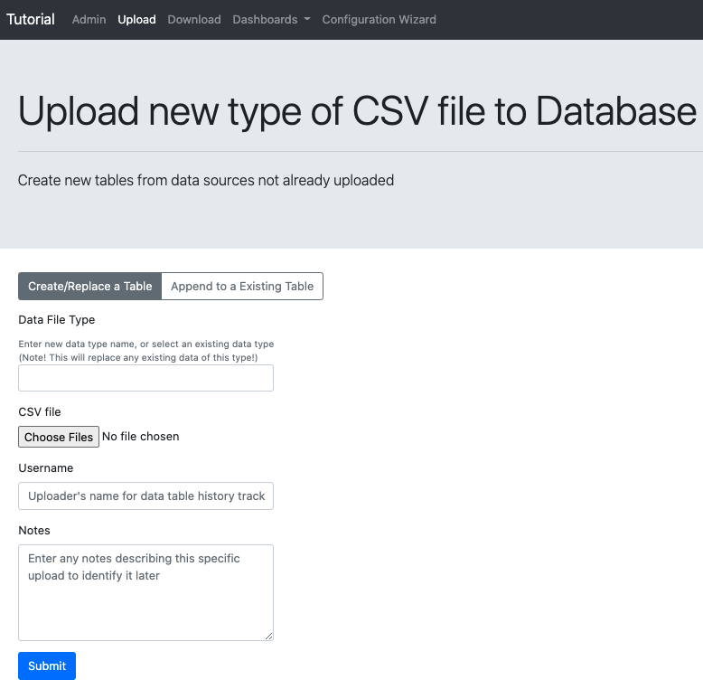
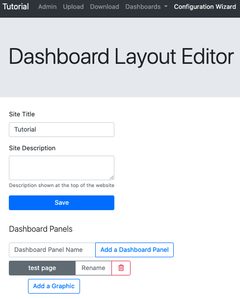
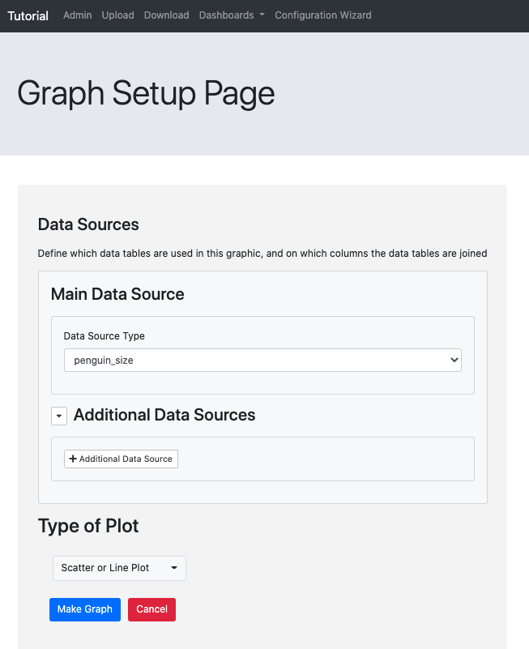
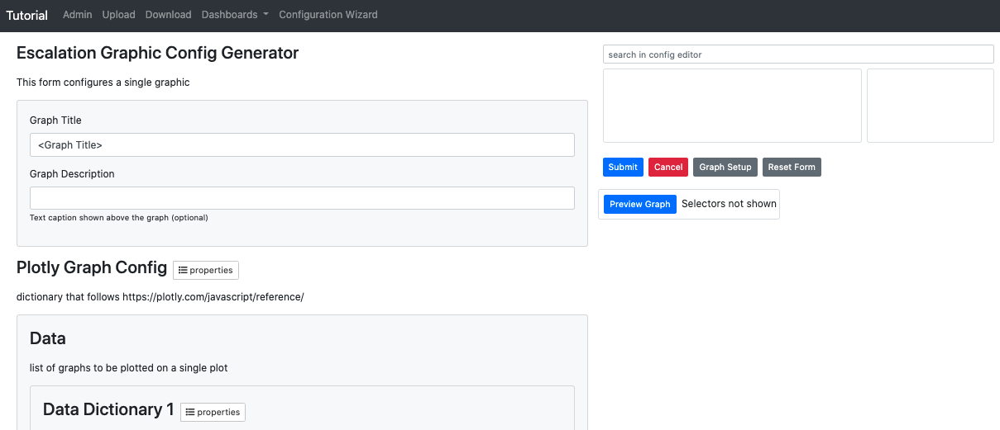
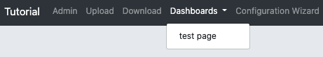

# Designing your dashboard layout using the Configuration Wizard UI

Before starting this tutorial, you should have your wizard app launched. 

Ready? Let's begin.

- First, open the URL where the wizard app is being hosted (e.g. http://localhost:8000/). Click on `Configuration Wizard` on the navbar at the top. You should see

- First, fill out the title, a description for your dashboard, and click save.
- Next, to add data to the app, click on `Upload` on the navigation bar on the top. Name your data table (Data File Type),
 pick a CSV file to upload (the CSV file must have a header with column names), give a username for the uploader, and click submit. 
  

- Click on `Configuration Wizard`.
- Now let's add our first page.
Enter a name for the new dashboard panel page and click `Add a Dashboard Panel`.
 

- Now let's add a graphic to the page. Click `Add a Graphic`. It will take you to the graphic config landing page.

- Choose what uploaded data you would like to use and what kind of graphic you would like then click `Make Graph`.

- Fill out a title and a description.
- Then specify the data on the axis (axes) and other customization options.
- To access advanced customization options click the properties buttons.
- You can use the search bar on the top right side to search for options in the config. The box below the search bar will give you the path in the config to options with matching words in the title or description. Clicking on the path will describe the option in the second box.
- You can click `Preview Graph` to view the current graph as long as the schema is valid.
- At the end bottom you can choose data selectors to allow users to interact with the graphs on a page.
- Once you are done, hit submit.
- Now you will have a graphic on your page. 

- You can see the graphic by clicking on `Dashboards` then on the title of your page.